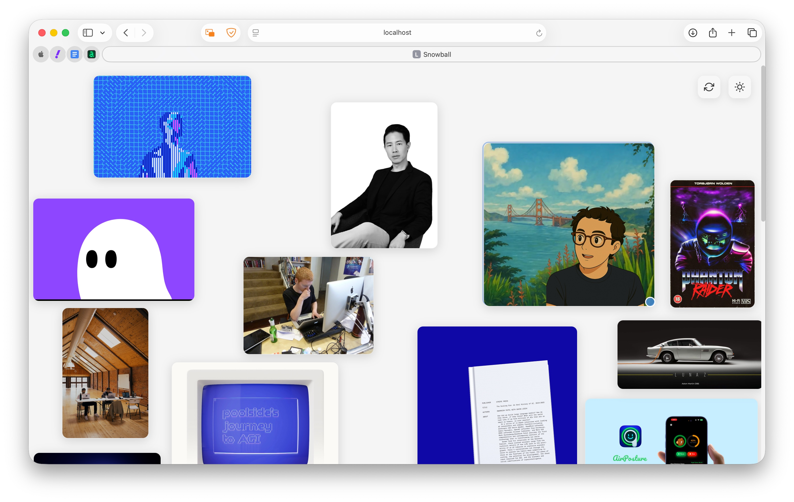
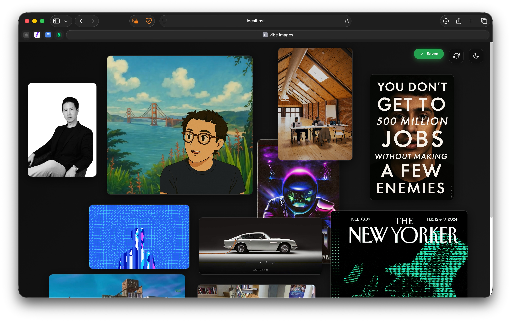

<p align="center">

<h1 align="center">Snowball</h1>
<h3 align="center">A web app that displays your screenshot collection.</h3> 
</p>

*forked from [sophiawisdom/index.html](https://gist.github.com/sophiawisdom/c1b16fcaca017d1aec2358c6fb619697)*

<div align="center">
    
</div>

<div align="center">
    
</div>

## Features

- **Drag & Drop**: Move images around by dragging them
- **Resizable Images**: Resize images by dragging the corner handle
- **GIF Support**: Displays animated GIFs with special indicators
- **Persistent Layout**: Remembers your custom positions and sizes
- **Dark/Light Mode**: Toggle between themes
- **Links**: Simple markdown file with your URLs


## Installation

1. Clone or download this repository
2. Install Python dependencies:
   ```bash
   pip3 install pillow pillow-heif
   ```

## Usage

1. Add your screenshot images to the project directory (supports PNG, JPEG, GIF, HEIF formats)

2. Generate the image metadata file:
   ```bash
   python lister.py
   ```

3. Start a local web server. You can use any of these methods:

   **Using Python:**
   ```bash
   python -m http.server 8000
   ```

   **Using Node.js (if you have it installed):**
   ```bash
   npx serve .
   ```

   **Using PHP (if you have it installed):**
   ```bash
   php -S localhost:8000
   ```

4. Open your browser and navigate to:
   ```
   http://localhost:8000
   ```

## Deployment

To deploy on Vercel:

1. Push your code to GitHub
2. Connect your GitHub repo to Vercel
3. Deploy automatically

The app includes a `vercel.json` configuration for easy deployment.
